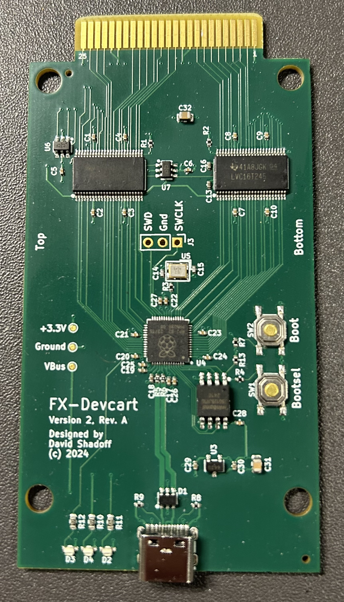
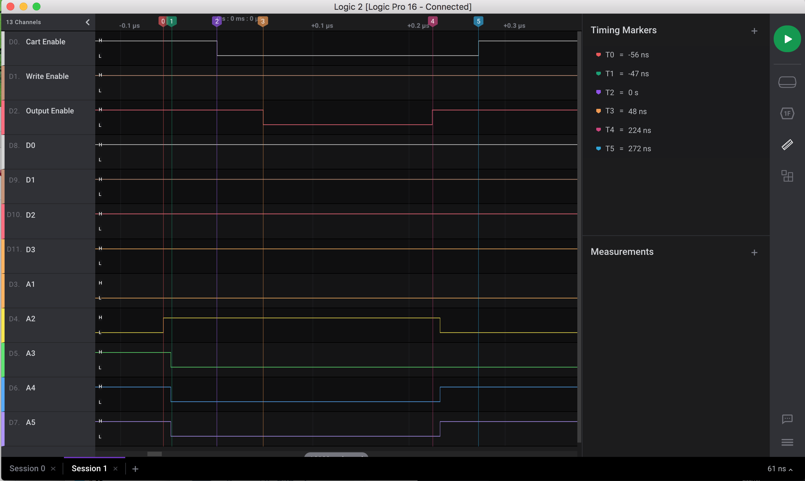
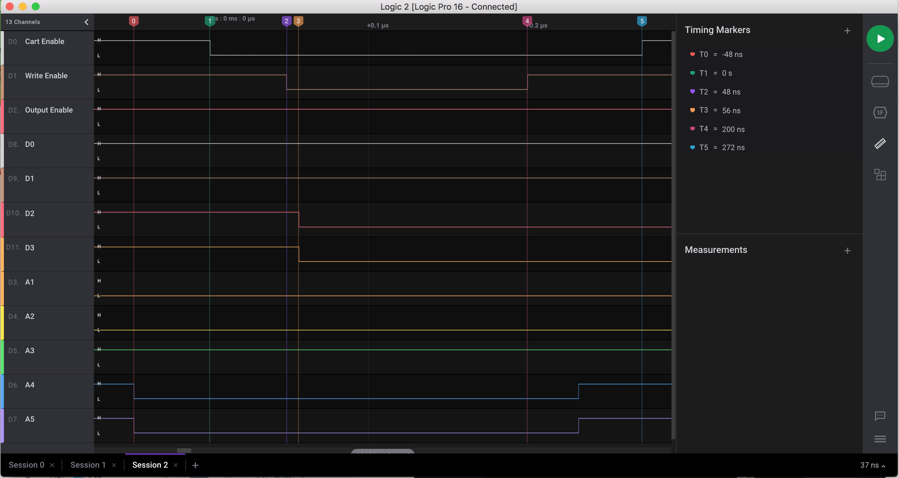

# PC-FX_devcart

This is a design of a development cart for the PC-FX, based almost entirely on the
RP2040 microcontroller.

##  Current Board Revision

The current version is Ver2_RevB.
[(For the Protoype board using an Olimex RP2040-Pico30 module, please click here.)](README_protoype.md)

The only changes from RevA to Rev B are related to schematic annotations, and a minor labelling update ont eh PC Board itself,
so the picture of RevA is included here.

In future, there will be plans for a proper 3D printed case.

## Genesis of the Project

The basis of the FX-BMP cartridge is that it consists of 128KB of memory, and the PC-FX can
actually boot from the cartridge memory under the right circumstances.

The FX-BMP memory doesn't need to be very fast - the bus access speed is cut in half when
accessing the FX-BMP range of memory. Assuming that the CPU reads the data at the rising
edge of /OE, this can be as slow as 174ns after /OE. (My design targets have been to keep this
turnaround time below 150ns).

The RP2040 has two CPU cores, and very fast GPIO access. It seemed possible to emply one
CPU core to deal with external access to the memory - emulating a SRAM bus interface - and
for the other CPU core to be used as a supervisor, allowing USB commands to read/write this
memory, downloading programs and preparing them to be booted from.

## Theory of Operation

### Signal Timing - Read

At 21MHz, you would expect the PC-FX to have a very fast bus access speed, however accesses to
the FX-BMP port are apparently clocked at half-speed (and are only 8 bits wide).

In general, bus accesses progress through the following steps for a read cycle:
- Address lines are set up
- /CE transitions low
- /OE transitions low
- The device being queried needs to ready the data, and output it onto the data bus
- /OE transitions high
- The device being queried needs to de-assert/tri-state its outputs
- /CE transitions high

While this is the normal situation, there can also be cases where the /CE line does not return to
high state before a subsequent address setup and corresponding /OE (or /WE) transition to low.

As our circuit operates at 3.3V, keep in mind that good-quality level-shifters will delay incoming
signals by roughly 5ns before they appear, and an additional 10ns on the return path, reducing the
available turnaround time for a read transaction.

Here is a visual of the actual timing of those sequences:

### Signal Timing - Write

In general, bus accesses progress through the following steps for a write cycle:
- Address lines are set up
- /CE transitions low
- /WE transitions low
- Data appears on the bus, to be written to the addressed device (not before /WE !)
- /WE transitions high
- In theory, the written-to device should latch data at this monment, but we can't react that fast, so we will latch earlier
- /CE transitions high

While this is the normal situation, there can also be cases where the /CE line does not returns to
high state before a subsequent address setup and corresponding /WE (or /OE) transition to low.

Here is a visual of the actual timing of those sequences:

### GPIO Versus PIO

My original idea was to emply PIOs to manage the bus, but there are delays in crossing
between CPU and PIO (to access the CPU's memory), which hobbled performance.  However,
it turned out that the GPIO access functions are also very fast, enabling the RP2040 to
reach the apparent required speed.

### CPU Overclock

In order the reach the required speeds, the CPU is overclocked to 240MHz (the default
CPU clock speed is only 125MHz, and it is only certified to 133MHz). This might at first
sound a bit scary and possibly dangerous, but there are many cases of pico-examples out
in the wild (and used commonly) which are clocked over 250MHz, with many people finding
it to work in the 400MHz range (of cource, USB and Flash access break down somewhere between
250MHz and 400MHz).

### GPIOs in USE

| GPIO | Signal |
|------|--------|
| GPIO0 | D0 |
| GPIO1 | D1 |
| GPIO2 | D2 |
| GPIO3 | D3 |
| GPIO4 | D4 |
| GPIO5 | D5 |
| GPIO6 | D6 |
| GPIO7 | D7 |
| GPIO8 | A0 |
| GPIO9 | A1 |
| GPIO10 | A2 |
| GPIO11 | A3 |
| GPIO12 | A4 |
| GPIO13 | A5 |
| GPIO14 | A6 |
| GPIO15 | A7 |
| GPIO16 | A8 |
| GPIO17 | A9 |
| GPIO18 | A10 |
| GPIO19 | A11 |
| GPIO20 | A12 |
| GPIO21 | A13 |
| GPIO22 | A14 |
| GPIO23 | A15 |
| GPIO24 | A16 |
| GPIO25 | A17 |
| GPIO26 | /CE |
| GPIO27 | /OE |
| GPIO28 | /WE |
